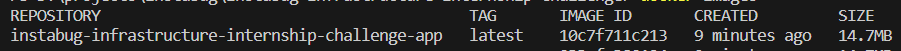
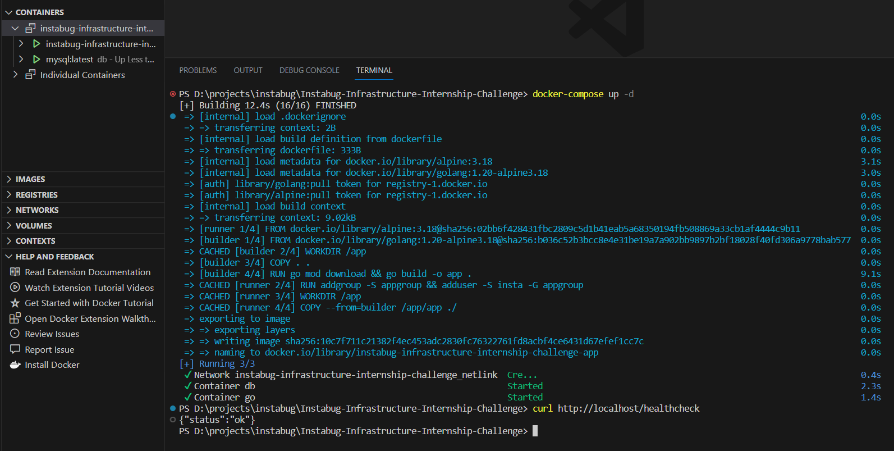
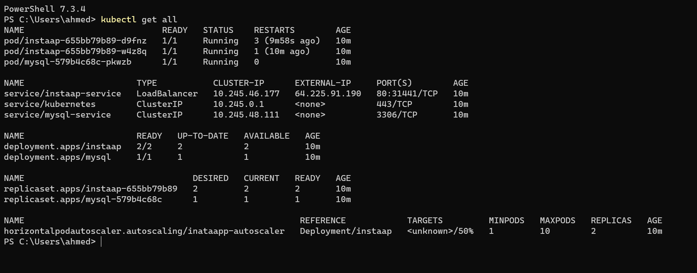
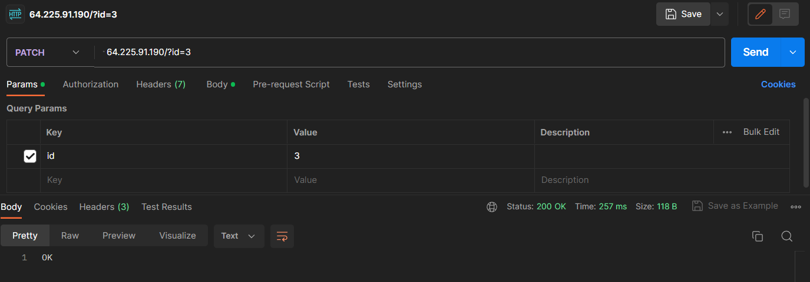
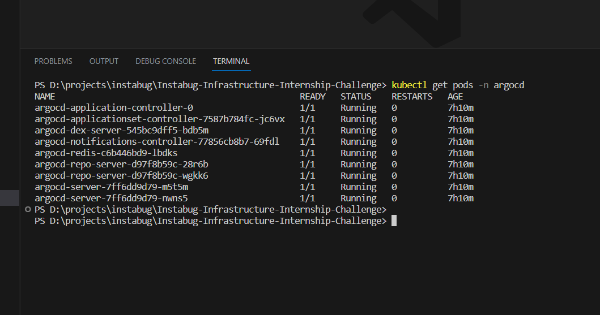
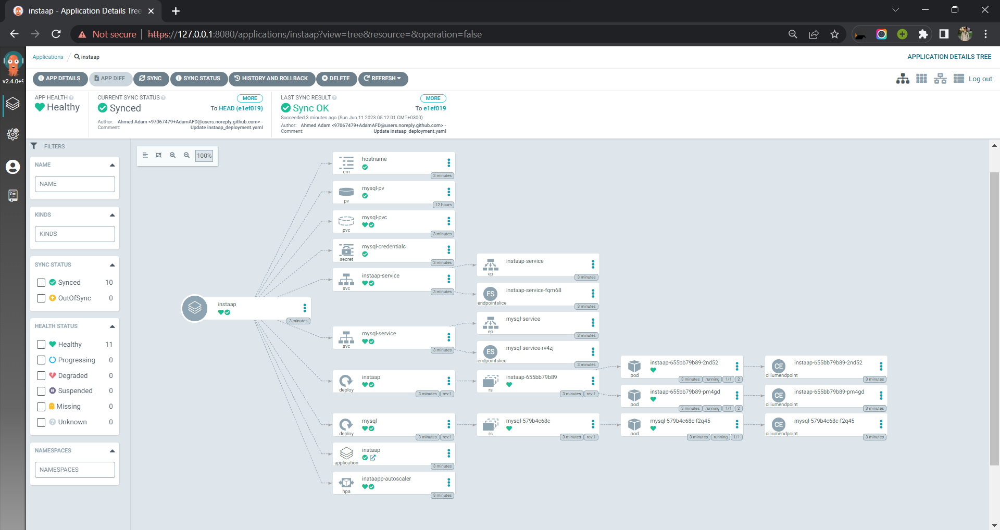
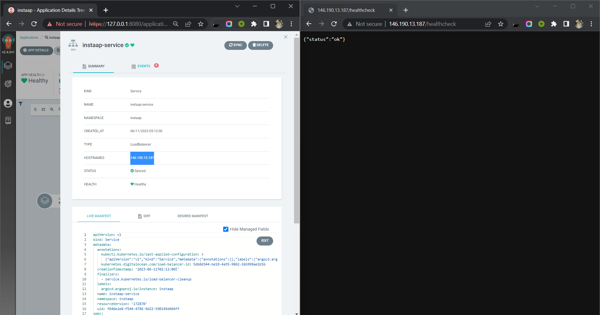

# Instabug-Infrastructure-Internship-Challenge 2023

## What I have done so far
1. Dockerizing the API GoLang app
    1. Multi-step build process to minimize the final image output to (14.6MB).
    3. Writing docker-compose file with MYSQL database that is working as required.

2. Writing CI/CD pipeline with Jenkins 
    1. Build the image successfully with the commit number & latest tag.
    2. Push the image to my docker hub registry.
    3. Provide an email notification service that is configured to send notifications when a build fails.

3. Creating Helm manifests for Kubernetes
    1. Created 9 resources to securely deploy the application.
    2. Configure the resources to ensure high availability.. etc.
    3. Making a kustomization file to organize the resources.

## Bunes tasks that i have implemented.
    1. Adding an autoscaling manifest for the number of replicas.
    2. Adding an ArgoCD app that points to helm manifests to apply GitOps concept.
    3. Using non-root user to add security to the container.
    4. Fixing a bug in the main.go => "GET" request.

## Screenshots of the running app on local and Production
1. Photo of the docker image after compression to (14.7mg)

2. Docker-compose working fine.

3. Deploying the App in K8s successfully.

4. Testing the "POST" request.

5. Testing the "GET" request after fixing it 

6. A sample to test the PATCH request(Before).

7. Testing The-PATCH-request

8. After the PATCH request

##ArgoCD with helmcharts 

1. ArgoCD is working well in kubernates 

2. ArgoCD working deployment after updating helmcharts

3. Ensuring that the application working as expected

4. The End ,I hope :D

